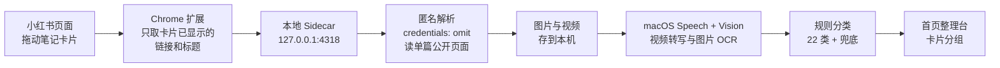
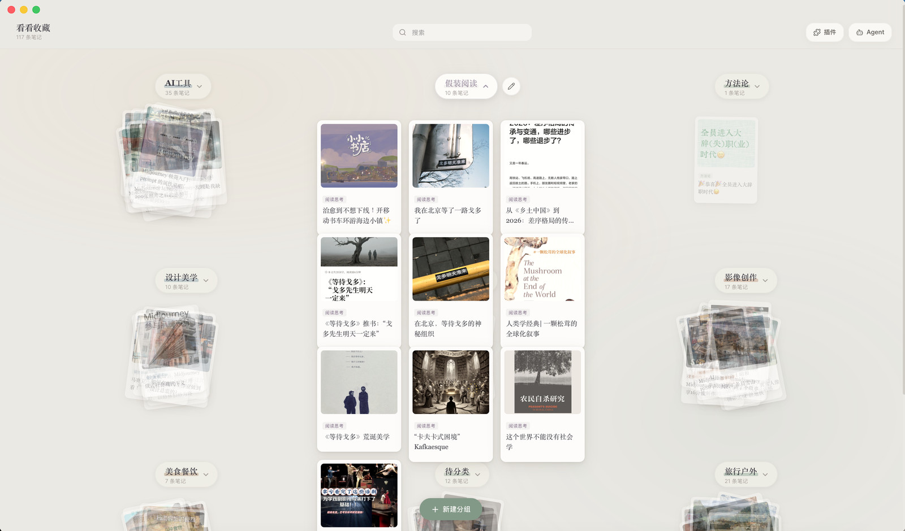

<div align="center">


# Kanbox

**专治收藏夹吃灰 —— 让存过的小红书笔记，这次真的找得回来。**


<br /><br />


<sub>收藏进来的笔记按类目摊在整理台上，每个分组是一叠可以展开的卡片</sub>

</div>

---

拖一条笔记进来，本地解析正文、下载配图、跑 OCR 把图里的文字也读出来，然后自动归类到首页。

**不依赖任何爬虫工具，也不用你的账号登录态去发请求。** 解析走的是匿名访问单篇公开页面，由你手动触发 —— 不带 Cookie、没有收藏夹抓取、没有定时任务；批量模式也只处理你主动粘贴的最多 50 条公开笔记链接。

数据默认存在你自己的电脑上，不上传云端；可选接入你指定的在线大模型做摘要与知识拓展（不填 key 就默认用本地摘要），数据目录也可切到 iCloud 实现换机自动复原。

## 🆕 v0.8.15 更新

- **并发编辑不丢失** — 完整性修复提交时只合并媒体派生字段，保留下载期间新修改的标题、标签、分类和阅读状态
- **媒体路径边界** — 本地文件检查仅允许当前笔记目录的单层文件，越界与编码穿越引用会显式标记异常
- **大数量完整性性能** — 新增 2 万媒体引用线性扫描压力测试，防止重复引用导致性能退化
- **版本漂移门禁** — CI 自动比对桌面端、Cargo、扩展、备份、归档和 README 版本号，任一处不一致即失败
- **发布流程现代化** — GitHub Actions 切换到 Node 24 运行时的 checkout、setup-node 与 release action，消除已弃用的 Node 20 依赖
- **版本号对齐** — 桌面应用、浏览器扩展、备份 schema、完整归档清单与安装包统一升至 v0.8.15

## 🆕 v0.8.14 更新

- **资料完整性批量修复** — 设置页可一键修复全部缺失图片或视频的笔记，无需逐条点击
- **受控并发** — 媒体恢复使用 3 路并发准备，不再长时间占用全局写队列
- **单条失败隔离** — 某条笔记无可用恢复源时仅记录该条失败，其他笔记继续修复
- **修复后二次校验** — 下载结束后重新检查本地文件，仍缺失时明确报错，不再误报成功
- **批量结果可见** — 界面分别显示成功和失败数量，并立即刷新完整性状态
- **版本号对齐** — 桌面应用、浏览器扩展、备份 schema、完整归档清单与安装包统一升至 v0.8.14

## 🆕 v0.8.13 更新

- **快照历史可见** — 设置页直接列出最近的自动快照和手动 JSON 备份，显示时间、笔记数、文件大小与健康状态
- **恢复前差异预览** — 选择快照后先计算当前与恢复后数量，以及新增、更新、保留、冲突和跳过，不再盲目恢复
- **一键安全合并** — 确认后直接从本机备份目录合并恢复，沿用修订号、同步冲突与删除墓碑规则，不覆盖较新的本机修改
- **损坏备份隔离** — JSON 无法解析或内容不合法的快照仍显示在历史中，但标记损坏并禁止恢复
- **路径边界保护** — 快照 API 只接受 Kanbox 生成的已知备份文件名，拒绝目录穿越与任意文件读取
- **版本号对齐** — 桌面应用、浏览器扩展、备份 schema、完整归档清单与安装包统一升至 v0.8.13

## 🆕 v0.8.12 更新

- **六小时恢复快照** — 自动备份从每天一份改为每 6 小时一个稳定槽位，保留最近 14 份，降低当天大量整理后只能回到早晨快照的风险
- **原子写入与自校验** — 自动快照先写唯一临时文件并完成 JSON 解析校验，再原子替换为正式备份；中断不会留下半截备份
- **回顾进度完整保护** — 手动 JSON 备份、自动快照与完整 `.kanbox` 归档全部包含每日回顾设置和完成进度
- **删除墓碑纳入归档** — `sync-meta.json` 首次进入完整归档；恢复时按修订号与更新时间合并墓碑，避免旧设备复活已删除笔记
- **旧备份继续兼容** — 没有回顾或同步元数据的旧 JSON/`.kanbox` 归档仍可恢复，旧版每日自动备份也参与统一保留策略
- **版本号对齐** — 桌面应用、浏览器扩展、备份 schema、完整归档清单与安装包统一升至 v0.8.12

## 🆕 v0.8.11 更新

- **同步冲突可见** — 新增“同步冲突”智能视图和实时数量，跨设备合并产生的待审核笔记不再藏在数据字段里
- **冲突字段提示** — 阅读器明确显示发生分叉的字段，自动合并结果可在原文、标签与分类上下文中直接检查
- **人工确认闭环** — 确认当前内容后清除冲突标记、推进修订号并记录本机设备身份，避免另一台设备重复提示旧冲突
- **同步元数据修复** — 修复前端标准化遗漏修订号、写入设备和冲突字段的问题，后端检测结果现在能完整到达界面
- **阅读状态不再丢失** — 同步修复标准化遗漏收藏、未读、稍后阅读与最近阅读时间的问题，刷新后状态保持一致
- **版本号对齐** — 桌面应用、浏览器扩展、备份 schema、完整归档清单与安装包统一升至 v0.8.11

## 🆕 v0.8.10 更新

- **粘贴内容预检** — 批量导入先规整输入，并按小红书笔记 ID 去重；同一链接即使带有不同查询参数也只导入一次
- **清晰的逐条结果** — 完成后分别显示新增、更新、失败和重复跳过数量，重复内容不再误报为失败
- **失败项一键重试** — 无效或临时失败的输入会保留在文本框中，可修正后直接再次导入，已成功内容不会重复粘贴
- **大批量安全边界** — 单次粘贴最多接收 500 行、去重后最多导入 50 条，保持 3 路并发准备与单次原子写入
- **扩展兼容不回退** — Chrome 扩展使用的结构化批量导入协议继续兼容，不受文本预检逻辑影响
- **版本号对齐** — 桌面应用、浏览器扩展、备份 schema、完整归档清单与安装包统一升至 v0.8.10

## 🆕 v0.8.9 更新

- **批量标签整理** — 批量模式可为当前选择添加或移除多个标签，自动去重、限制长度，并以“移除优先”处理同名冲突
- **批量统一分类** — 可一次将选中笔记归入同一分类，每条记录都更新跨设备修订信息
- **全选当前结果** — 一键选择当前搜索、智能视图和分类筛选后的全部结果，不会误选被筛掉的笔记
- **原子批量写入** — 标签和分类在校验全部 ID 后单次原子写回；遇到无效或已不存在的笔记整批拒绝，不产生部分修改
- **安全批量删除** — 批量删除改为一次性写回，并为每条笔记记录跨设备删除墓碑；媒体清理失败不影响删除记录完整性
- **版本号对齐** — 桌面应用、浏览器扩展、备份 schema、完整归档清单与安装包统一升至 v0.8.9

## 🆕 v0.8.8 更新

- **高级查询语法** — 支持 `title:`、`author:`、`tag:`、`category:`、`ocr:`、`transcript:` 字段限定，双引号精确短语和 `-` 排除词可组合使用
- **原有搜索不回退** — 普通关键词仍覆盖标题、正文、图片 OCR、视频文稿、作者、标签、分类和分组，并继续支持拼音与模糊匹配
- **智能资料视图** — 首页新增已读、近 7 天读过和今日收录视图，与收藏、未读、稍后阅读、搜索和分类自由组合
- **数量即时可见** — 每个智能视图直接显示匹配条数，打开资料库即可看清待读队列和当天收录情况
- **最近阅读排序** — 新增按最近阅读时间排序，未读内容稳定置后，方便接着上次的阅读脉络继续整理
- **本地时间语义** — “今日收录”按设备本地日期计算，“近 7 天读过”排除未来或损坏时间，旧资料安全兼容
- **版本号对齐** — 桌面应用、浏览器扩展、备份 schema、完整归档清单与安装包统一升至 v0.8.8

## 🆕 v0.8.7 更新

- **收藏与阅读状态** — 每条笔记支持收藏、未读、已读和稍后阅读，状态直接写入 `notes.json` 并参与现有修订与跨设备冲突合并
- **卡片与阅读器快捷操作** — 卡片可一键收藏；打开详情自动标为已读，阅读器中可收藏或加入稍后阅读
- **状态筛选** — 首页新增收藏、未读、稍后阅读筛选，与全文搜索和分类筛选组合使用
- **批量整理** — 批量模式支持批量收藏、加入稍后阅读和标为已读，单次原子写回并保留失败反馈
- **每日回顾联动** — 稍后阅读和未读内容优先进入每日回顾；回顾中选择“已回顾”或“稍后复习”会同步更新笔记状态
- **重导入不丢状态** — 同一笔记重新采集时保留收藏、阅读状态和最近阅读时间，旧资料缺少字段时按未读兼容
- **版本号对齐** — 桌面应用、浏览器扩展、备份 schema、完整归档清单与安装包统一升至 v0.8.7

## 🆕 v0.8.6 更新

- **资料库级回顾进度** — 每日列表、已回顾、稍后复习和完成状态写入资料库的 `daily-review.json`，不再依赖易丢失的 WebView `localStorage`
- **历史上的今天与重新发现** — 优先重现往年同日收藏，并优先选择长期未回顾内容；同一天顺序稳定，跨天自动轮换
- **每日数量可配置** — 可选择每天回顾 3、5、8、10、15 或 20 条，修改后立即生成符合新数量的当日列表
- **可见进度与连续统计** — 支持已回顾、稍后复习、当日完成、再看一遍、连续完成天数和累计完成天数
- **迁移归档不丢进度** — 回顾数据跟随资料库安全迁移，并纳入 JSON 备份和含全部媒体的完整 `.kanbox` 归档恢复
- **版本号对齐** — 桌面应用、浏览器扩展、备份 schema、完整归档清单与安装包统一升至 v0.8.6

## 🆕 v0.8.5 更新

- **旧资料库自动发现** — 受限扫描本机默认目录、iCloud、旧版目录、历史自定义位置、0.8.4 迁移快照与本地完整归档；不会遍历整台电脑或读取无关文件
- **候选健康评估** — 每个资料库显示路径、笔记数、媒体数、体积、最后更新时间和损坏状态；无法解析的数据保持可见但禁止直接恢复
- **恢复前差异预览** — 恢复前计算当前数量、恢复后数量、新增、更新、保留、冲突、无效记录和分组数量；`.kanbox` 归档必须先完成 SHA-256 校验
- **空库主动找回** — 当前资料明确加载为空时自动扫描一次，发现历史资料后直接打开恢复区域，避免把存储指针丢失误认为新安装
- **安全恢复闭环** — 非空资料库恢复前自动创建完整归档；目录恢复沿用事务迁移和旧目标快照，候选 ID 每次重新扫描确认，拒绝任意路径注入
- **版本号对齐** — 桌面应用、浏览器扩展、备份 schema、完整归档清单与安装包统一升至 v0.8.5

## 🆕 v0.8.4 更新

- **任意位置安全迁移** — 存储切换现在始终从当前活动资料库迁移，完整覆盖本机、iCloud、自定义目录之间的七种切换组合，不再错误地固定读取本机旧副本
- **目标资料安全合并** — 目标目录已有内容时合并笔记、分组、删除墓碑、媒体和备份；当前设置优先，同修订分叉继续记录同步冲突，不再静默覆盖或跳过迁移
- **事务提交与可恢复快照** — 在目标旁构建暂存资料库并校验笔记和媒体，成功后才原子切换；源资料始终保留，旧目标自动改名为完整恢复快照，异常中断不会修改当前目标
- **迁移结果可见** — 切换完成后报告笔记总数和冲突数量，只有迁移成功后才写入存储位置指针；新增七种切换矩阵、已有目标合并与模拟断电测试
- **版本号对齐** — 桌面应用、浏览器扩展、备份 schema、完整归档清单与安装包统一升至 v0.8.4

## 🆕 v0.8.3 更新

- **每日回顾正式上线** — 首页新增清晰可见的「每日回顾」入口，每天稳定抽取 5 条旧收藏；支持进度保存、前后切换、打开完整阅读与当日完成状态
- **升级后资料重新可见** — 修复 v0.8.2 安装包漏打包后台模块导致本地服务无法启动、界面误显示空库的问题；原有本机与 iCloud 数据文件不会被覆盖
- **发布防回归** — 新增安装包资源完整性自动测试，逐项核对本地服务的模块依赖，阻止漏文件版本再次发布
- **版本号对齐** — 桌面应用、浏览器扩展、备份 schema 与安装包统一升至 v0.8.3

## 🆕 v0.8.2 更新

- **完整资料库归档** — 新增 `.kanbox` 流式归档，包含笔记、分组、全部图片与视频；每个文件都有 SHA-256 清单，恢复前阻断路径穿越、未登记文件、篡改内容和超大解压包
- **中断安全恢复** — 媒体逐文件使用临时名并原子替换，恢复中断不会留下截断视频；同一归档可重复恢复和续跑
- **跨设备冲突合并** — 笔记与工作区增加设备身份、修订号和更新时间；同修订分叉稳定合并并保留标签，较新的本机编辑不会被旧备份覆盖；删除墓碑阻止旧设备复活已删除笔记
- **批量导入** — 粘贴框支持每行一条链接，单次最多 50 条、3 路限流解析，单条失败不会中断整批
- **测试加强** — 新增真实本地 API 端到端测试、归档篡改与中断故障注入，以及 10,000 条笔记冲突合并压力测试
- **版本边界** — 桌面应用、扩展、备份 schema 与双架构安装包统一升至 v0.8.2；Developer ID 公证和 Chrome 商店发布继续保留为可选付费发布项

## 🆕 v0.8.1 更新

- **完整性修复不再丢数据** — 缺失图片会从 `sourceImageUrls` 重新下载，无法恢复时保留现有图片引用与 OCR；缺失视频也可补回，并保留已有文稿
- **存储迁移更安全** — 新增迁移中标记和 `notes.json` 内容校验，复制失败不会再被误报为成功；新安装默认使用本机，已有 iCloud 资料库继续兼容；自定义分组与排序写入 `workspace.json` 并纳入备份
- **导入与断线体验** — 匿名解析、媒体下载和 OCR 移出全局写锁；本地服务短暂重启时保留上次成功加载的资料库，不再闪成空库
- **扩展与安装包修复** — 正式安装包补齐 popup 与图标资源；扩展功能收敛到当前后端真正支持的小红书单篇公开笔记，消除无效的多平台入口；popup 改为安全 DOM 渲染
- **安全与依赖更新** — Markdown 链接只允许 http/https，API Key 默认隐藏；Next.js / ESLint 配置升级到 16.3.2，并清理发布阻断的 Lint 问题
- **版本号对齐** — 桌面应用、浏览器扩展、备份 schema 与安装包统一升至 v0.8.1

## 🆕 v0.8.0 更新

- **前端稳定性与可靠性修复** — 笔记变更回调改用最新快照（不再用过期闭包覆盖新数据）；拖拽分组区补空值防护，杜绝 null 传播崩溃；AI 摘要/拓展返回类型如实声明（`note?: Note`），消除接口调用空引用风险；`repairNote` 改显式判空
- **安全加固** — 打开外部链接前校验 scheme（仅放行 http/https，阻断 `javascript:`/`file:` 注入）
- **性能优化** — 设置面板四项异步请求改 `Promise.allSettled` 并行；键盘快捷键相关回调用 `useCallback` 稳定引用，避免监听器反复重建
- **国际化修复** — 去除 i18n 文件 UTF-8 BOM；语言检测延迟到首次翻译调用，消除 SSR hydration 不匹配；日期显示负数天数兜底为「今天」
- **错误边界增强** — 出错页新增「重试」按钮（保留应用状态），与「重新加载」并存
- **版本号对齐** — 应用与浏览器插件统一升至 v0.8.0

## 🆕 v0.7.9 更新

- **后端安全与稳定性修复** — 重复导入不再整条覆盖（手动分类/标签/AI 摘要与拓展全部保留）；浏览器扩展 origin 白名单收窄为固定扩展 ID，不再信任任意 `chrome-extension://` 扩展读取笔记与明文密钥；手动转写移出写队列，长视频转写期间不再阻塞编辑/导入；自定义存储目录不可写时回退本机（不再「本地服务未连接」）；标签重命名/删除实时广播
- **数据保真度与一致性** — 匿名解析透传点赞/收藏/评论数；导出 HTML 校验链接协议（阻断 `javascript:` 注入）；导出 Markdown 标题/作者/标签单行化；手动与自动备份 schema 版本统一；恢复体积上限统一 10MB；删除死代码、统一唯一临时文件名
- **浏览器插件更新** — 插件版本对齐应用 v0.7.9；manifest 加 `key` 字段固定扩展 ID；popup 支持多平台（小红书/B站/微博/抖音/知乎/快手/头条）识别；「打开 Kanbox」改为真正打开桌面 App

## 🆕 v0.7.8 更新

- **修复分组空白** — 首页「显示条数但下方无卡片」：滚动位置追踪失效（挂在内层非滚动容器的 onScroll 从不触发）+ 视口高度误取外层高度，导致离屏裁剪永久跳过折叠区以下分组。改为监听 window 滚动 + 取 window.innerHeight，且小库（≤200 条）全量渲染不再裁剪

## 🆕 v0.7.7 更新

- **分类再扩充** — 新增「影视娱乐」「情感治愈」两个分类，分类体系达到 22 类 + 兜底「其他」

## 🆕 v0.7.6 更新

- **分类体系大扩充** — 新增健身运动、健康养生、家居生活、母婴育儿、宠物、汽车、职场、理财投资、游戏 9 个常用分类
- **分类歧义修复** — 「教程/指南」等通用后缀不再抢占具体主题词（如「养猫指南」正确归入宠物而非方法论）

## 🆕 v0.7.5 更新

- **「数码硬件」分类** — 覆盖路由器、手机、电脑、键盘、耳机、相机等数码硬件
- **「时尚美妆」分类** — 覆盖穿搭、美妆、护肤、彩妆等
- **兜底分类「其他」** — 推断不出具体分类的笔记归入「其他」组，不再积压在待整理

## 🆕 v0.7.4 更新

- **重新归档** — 待整理里积压的历史笔记一键重新分类归位，自动进入对应分类组
- **手动分类不丢失** — 前端不再覆盖后端已持久化的分类，拖到分类后真正写入数据文件

## 🆕 v0.7.3 更新

- **卡片阅读按钮** — 卡片 hover 浮现「阅读」按钮，阅读器排版优化（AI 摘要/知识拓展竖线式排版）
- **新笔记自动归位** — 导入即按分类自动进入对应分组，只有无法分类的才进「待整理」（置顶）

## 🆕 v0.7.2 更新

- **拖动分类持久化** — 卡片拖到任意分类（含「待分类」→ 新分类、已分类 → 其他分类）后刷新不再丢失，分类真正写入数据文件

## 🆕 v0.7.1 更新

- **白屏修复** — 新增 ErrorBoundary 与全局错误兜底，渲染异常不再白屏，显示「重新加载」按钮
- **iCloud 存储 + 自定义位置** — 数据目录支持 iCloud Drive/kanbox（换机自动复原）、本机默认、自定义文件夹三种位置，设置面板一键切换
- **AI 推荐服务商/模型** — AI 摘要/拓展与音转文字两处配置新增推荐下拉（DeepSeek / OpenAI / Kimi / 智谱 / 通义 / MiMo），模型带一句话介绍与擅长

## 🆕 v0.7.0 更新

- **知识拓展按类型取素材** — 图文笔记用「标题 + 正文」拓展，视频笔记用「视频文稿」拓展，避免只基于标题的浅拓展

## 🆕 v0.6.2 更新

- **长音频分片转写** — 修复 MiMo 语音输入 10MB 限制，超长音频自动切块逐片转写再合并
- **转写字幕时间码分段** — 转写结果带时间码分段
- **知识拓展去开场白** — 去除 AI 回复里的寒暄与自我说明，只保留知识正文

## 🆕 v0.6.1 更新

- **外链打开修复** — 修复「查看原帖」外链无法打开的问题
- **数据安全加固** — 修复并发写入可能损坏/静默清空数据文件的致命链路，全代码审计

## 🆕 v0.6.0 更新

- **自动 AI 流水线** — 素材收录后 5 秒自动执行「转写 → 摘要 → 知识拓展」，也可手动补跑
- **转写文本智能分段** — 长文稿自动分段，便于阅读

## 🆕 v0.5.1 更新

- **MiMo 语音转写** — 音转文字走 chat/completions 的 input_audio 形态，而非 Whisper 路由

## 🆕 v0.5.0 更新

- **音转文字增强** — 可选接入在线大模型（MiMo ASR / Whisper）获得更准确文稿
- **AI 摘要/知识拓展持久化** — 摘要与拓展结果保存到笔记，不随刷新丢失
- **Markdown 渲染** — AI 生成的摘要/拓展支持 Markdown 排版
- **测试连接反馈** — 填完 API 配置可一键测试连通性

## 🆕 v0.4.0 更新

- **AI 摘要 + 知识拓展** — 接入 OpenAI 兼容的在线大模型（OpenAI / MiMo / DeepSeek / Moonshot 等），一键生成摘要与知识拓展
- **音转文字设置** — 独立的转写配置入口

## 🆕 v0.3.4 ~ v0.3.10 更新

- **小红书收录稳定性** — 修复 token 捕获、匿名解析失败、空壳笔记补全、短链展开等问题，收录更稳定
- **本地服务连接** — 导入前即时健康检查，端口占用/启动错误给出明确提示
- **语言切换与纯 URL 导入** — 修复语言切换失效、恢复纯 URL 导入的完整解析链

## 🆕 v0.3.3 更新

- **服务连接修复** — 修复「本地服务未连接」问题，改善模块路径解析和 Node 发现
- **窗口拖动修复** — 修复窗口不可拖动问题，优化 CSS drag 区域
- **Agent 检测修复** — 增强 Claude Code/Codex 路径检测，支持更多安装位置
- **GitHub 按钮修复** — 修复扩展下载按钮点击无反应问题
- **导出功能修复** — 修复导出失败问题，添加服务健康检查
- **设置面板优化** — 加快动画速度，异步加载数据

## 🆕 v0.3.2 更新

- **窗口定位修复** — 修复窗口卡在右下角的问题，启动时自动居中
- **本地服务启动修复** — 新电脑安装后自动修复 Node 二进制权限，解决「本地服务未连接」
- **扩展引导优化** — 插件安装引导改为从 GitHub 下载，附详细步骤
- **导出功能修复** — 修复导出按钮「load failed」错误，改用 blob 下载

## 🆕 v0.3.1 更新

- **批量导出** — 支持 Markdown 和 HTML 格式批量导出所有笔记
- **拼音搜索** — 输入拼音首字母即可搜索中文笔记（如 'shouji' 匹配 '手机'）
- **模糊匹配** — 字符按顺序出现即可匹配
- **用户引导** — 首次使用时显示 3 步引导流程
- **多语言支持** — 中文/英文界面，设置页面切换语言

## 🆕 v0.2.1 更新

- **快手支持** — 浏览器扩展可收藏快手视频和图片
- **头条支持** — 浏览器扩展可收藏头条文章和视频
- **备份恢复** — 设置页面支持从 JSON 备份文件恢复数据
- **扩展 Popup 增强** — 显示当前平台指示器（支持 7 个平台）
- **数据迁移** — 支持从旧版本备份文件导入笔记

## 🆕 v0.2.0 更新

- **自动定时备份** — 每日自动备份，保留最近 7 份，存储在 data/backups/
- **实时更新** — 使用 Server-Sent Events 替代 2 秒轮询，笔记变更即时刷新
- **虚拟列表优化** — 100+ 笔记时只渲染可见区域，大幅降低内存占用
- **AI 摘要** — 本地文本提取摘要（无需 API key），点击笔记详情中生成
- **抖音支持** — 浏览器扩展可收藏抖音视频和笔记
- **知乎支持** — 浏览器扩展可收藏知乎文章和回答
- **Bug 修复** — 修复新电脑本地服务启动失败、CI 测试失败等问题

## 🆕 v0.1.0 更新

- **设置页面** — 数据统计、备份创建、数据完整性检查与修复
- **标签管理** — 查看所有标签、批量重命名、批量删除
- **分组拖拽排序** — 自定义分组支持拖拽调整顺序
- **B站支持** — 浏览器扩展可收藏 Bilibili 视频和文章
- **微博支持** — 浏览器扩展可收藏微博帖子和图片
- **Firefox 兼容** — 浏览器扩展支持 Firefox 109+

## 🆕 v0.0.3 更新

- **扩展 Popup 面板** — 点击扩展图标查看连接状态、收藏统计、最近收藏
- **右键菜单收藏** — 右键笔记链接或图片，一键收藏到 Kanbox
- **已收藏标记** — 小红书页面上已收藏的笔记显示绿色 ✓ 标记
- **扩展图标** — 全新设计的扩展图标（16/32/48/128px）
- **安装引导优化** — 应用内插件安装引导更清晰

## 🆕 v0.0.2 更新

- **窗口拖动修复** — macOS 下可正常拖动窗口
- **分组删除** — 自定义分组支持删除
- **键盘快捷键** — ⌘+F 搜索、⌘+N 新建分组、⌘+E 导出、Escape 关闭
- **图片全屏查看** — 点击图片进入全屏 lightbox
- **查看原帖** — 笔记详情中可打开小红书原帖
- **笔记排序** — 最新/最早/标题三种排序
- **批量选择** — 多选笔记进行批量操作
- **暗色模式** — 自动跟随系统设置
- **新笔记标记** — 24 小时内的笔记显示绿色圆点

## 🆕 v0.0.1 更新

- **粘贴链接导入** — 无需打开小红书页面，直接粘贴笔记 URL 即可导入
- **笔记编辑** — 支持修改标题和标签，修正 OCR 识别错误
- **数据导出** — 一键导出全部笔记为 JSON 备份文件
- **分类筛选** — 搜索栏新增类目筛选 chips，快速定位笔记
- **项目重命名** — 从「看看收藏」正式更名为 Kanbox

## 🤔 为什么做这个

小红书用户自己最常说的一句话就是**收藏夹吃灰** —— 收藏的那一下确实觉得有用，然后就再也没打开过。

但吃灰不全是懒，是收藏夹本身没法用：

- 存了三百条，想找那条讲配色的，翻不到 —— 收藏夹不支持搜正文
- 干货全写在图片里，搜索框对图里的字完全无能
- 笔记被作者删了、被限流了，你的收藏就变成一张灰色占位图
- 想分类得手动建收藏夹，建完也懒得整理

于是「等有空再看」就变成了永远不看。

这个 App 的思路很简单：**把你在意的那几条，抄一份到自己电脑上。** 正文、配图、视频、图里的文字和视频文稿都存在本机。之后搜关键词就能命中，原帖删了也不影响你 —— 灰就吃不起来了。

## ✨ 能做什么

| | 功能 | 说明 |
|:--:|---|---|
| 🖱️ | **拖拽导入** | 从小红书搜索页直接把笔记卡片拖进 App 画布，或在笔记详情页拖右下角按钮 |
| 📋 | **粘贴链接导入** | 直接粘贴小红书笔记 URL，无需打开小红书页面 |
| 🖱️ | **右键收藏** | 右键笔记链接或图片，一键收藏到 Kanbox |
| ✓ | **已收藏标记** | 小红书页面上已收藏的笔记显示绿色标记 |
| 📺 | **多平台支持** | 支持小红书、B站、微博、抖音、知乎、快手、头条内容收藏 |
| 🔍 | **图片文字可搜** | 调用 macOS 原生 Vision 框架做本地 OCR，中英文都认，图里的干货变成可搜索文本 |
| 🔤 | **拼音搜索** | 输入拼音首字母搜索中文笔记，支持模糊匹配 |
| 🤖 | **AI 摘要** | 本地提取式摘要默认可用；也可接入在线大模型（DeepSeek/OpenAI/Kimi/智谱/通义/MiMo）生成更精准摘要 |
| 🧠 | **知识拓展** | 接入在线大模型后，围绕收藏内容拓展背景知识、概念解释、延伸话题与实用建议 |
| 🔄 | **自动 AI 流水线** | 素材收录后自动执行「转写 → 摘要 → 知识拓展」，也可手动补跑 |
| 🎬 | **视频文稿** | 视频保存到本机，使用 macOS 离线 Speech 分段转写；可用在线大模型增强，长音频自动分片 |
| 🗂️ | **自动分类** | 按标题、正文、OCR 文本和标签打分，自动分到 22 个类目，推断不出归入兜底「其他」 |
| 🖱️ | **拖动分类** | 卡片拖到任意分类（含「待分类」）即时持久化，刷新不丢失 |
| 🔁 | **重新归档** | 待整理里积压的笔记一键重新分类归位，手动分类不会被覆盖 |
| ☁️ | **iCloud 同步** | 数据目录可切到 iCloud Drive/kanbox，换机登录同一 Apple ID 自动复原；也支持本机默认或自定义位置 |
| 🖼️ | **配图本地化** | 图片下载到本机，原帖删除、限流、防盗链都不影响你已存的内容 |
| 🤖 | **Agent 可读** | 内置 MCP server，Claude Code / Codex 可以直接搜你的本地笔记库当资料 |
| 📝 | **笔记编辑** | 修改标题、标签，修正 OCR 错误 |
| 💾 | **数据导出** | 一键导出全部笔记为 JSON 备份文件 |
| 🏷️ | **分类筛选** | 按类目快速筛选，结合关键词搜索 |
| ⚙️ | **设置页面** | 数据统计、备份管理、数据完整性检查 |
| 🏷️ | **标签管理** | 查看、重命名、删除标签，批量操作 |
| 📊 | **分组排序** | 自定义分组支持拖拽调整顺序 |
| 🛡️ | **封控风险低** | 不是爬虫，不用你的登录态发请求。不读 Cookie、不登录、不批量、不做后台抓取 |

## 🔄 工作原理



关键点：第 4 步的解析请求**显式带 `credentials: 'omit'`**，不携带任何 Cookie。失败就直接报错，**不会回退到你登录着的浏览器**。整条链路只处理你手动拖进来的那一条笔记。

## 🛡️ 为什么不用担心封号

市面上大多数小红书工具是**爬虫思路**：拿你的 Cookie 或扫码登录，然后用你的身份去批量请求接口。这种做法效率高，但风控一来账号就没了 —— 461、471、滑块验证、限流、封禁都是常见结局。

这个项目走的是另一条路：

| | 爬虫工具 | Kanbox |
|---|---|---|
| 身份 | 用你的账号登录态发请求 | **匿名请求，不带 Cookie** |
| 频率 | 收藏夹抓取、定时、自动翻页 | **仅处理你手动提供的单篇链接；批量上限 50 条** |
| 入口 | 逆向接口 | 你已经打开的那个公开页面 |
| 失败时 | 换 UA、换代理、重试 | **直接报错，不绕验证** |
| User-Agent | 伪装成真实浏览器 | **老实自报身份，不伪装** |
| 封控风险 | 高 | **很低** |

代码层面都可以核对：

- 解析请求显式写着 `credentials: 'omit'` —— `scripts/lib/anonymous-note-resolver.mjs:186`
- 图片和视频下载同样不带凭证 —— `scripts/lib/media-import.mjs`、`scripts/lib/video-import.mjs`
- UA 是 `KanboxFavorites/0.1 anonymous-local-resolver`，**没有伪装成 Chrome**，平台一看就知道这是谁在请求
- 没有代理池、没有重试退避、没有 UA 轮换 —— 这些爬虫标配一个都没有

**匿名解析失败时直接抛错，不会回退到你登录着的浏览器** —— 宁可这一条导不进来，也不动你的账号。

> 严格说没有任何第三方工具能承诺 100% 安全。但这里的请求模式和你自己用浏览器点开一篇笔记基本没区别，也不涉及任何账号行为，所以风险很低。

## 🔐 隐私边界（这部分请认真看）

这个项目对「能碰什么」划得很死，因为它处理的是你的浏览记录：

**✅ 会做的**

- 只解析你手动拖进来的**单条**公开笔记页面
- 匿名 HTTP 请求，不带 Cookie、不带 token
- 图片只从 `.xhscdn.com` / `.xhsimg.com` 下载，其他域名直接拒绝
- 所有数据写在本机目录或你自己的 iCloud，服务只监听 `127.0.0.1`
- OCR 用 macOS 系统框架跑，图片不出本机

**❌ 不会做的**

- 不读你的小红书 Cookie 或登录态
- 不访问收藏夹、关注列表、评论接口
- 不做定时任务、后台抓取、批量同步
- 默认不联网做 AI：本地 OCR、本地视频转写、本地摘要全部离线
- 只有当你**主动填入 API key 并开启**在线 AI 摘要/知识拓展/音转文字增强时，笔记内容才会单条、按需发往你指定的服务商（DeepSeek / OpenAI / Kimi 等）
- 没有任何 Kanbox 自有后端：数据只在你本机，或你自己的 iCloud

**Chrome 扩展的权限清单**（`browser-extension/manifest.json`，可以自己核对）：

```json
"host_permissions": ["http://127.0.0.1:4318/*"]
```

只有本地回环地址一条。**没有 `tabs`、没有 `cookies`、没有 `webRequest`** —— 扩展在技术上就不具备后台开标签页或读取账号凭证的能力，它唯一做的事是把你正在看的这个卡片上已经显示出来的链接和标题，递给本地服务。

## 📦 安装

> ⚠️ 目前是 **macOS 13+、Apple Silicon 专用**。本地 OCR 和视频文稿依赖系统的 Vision / Speech 框架。

### 推荐：下载 Release 安装包

从 [GitHub Releases](https://github.com/sexyfeifan/Kanbox/releases/latest) 下载最新 DMG，把「Kanbox」拖进”应用程序”即可；安装包已包含运行环境，**不需要 Node.js、npm 或终端命令**。

因为当前版本没有 Apple Developer 公证，首次打开如果被 macOS 拦截：先尝试打开一次，再前往 **系统设置 → 隐私与安全性 → 仍要打开**。只需操作一次。

### 从源码构建

```bash
git clone https://github.com/sexyfeifan/Kanbox.git
cd Kanbox
npm install
npm run tauri:build
```

产物在 `src-tauri/target/release/bundle/`，装完打开「Kanbox」。

### 装 Chrome 扩展

App 里点「浏览器插件」按钮会自动帮你打开 Chrome 扩展页和插件文件夹。或者手动：

1. Chrome 打开 `chrome://extensions`
2. 右上角开启 **开发者模式**
3. 点 **加载已解压的扩展程序**，选本项目的 `browser-extension/` 目录

> Tauri 不能替你安装 Chrome 扩展，这一步只能手动。

### 开始用

**方式一：拖拽导入**

打开小红书搜索页，**把笔记卡片拖进 App 窗口的任意位置**。画布会依次显示识别 → 匿名解析 → 保存图片和 OCR → 收录完成。

也可以打开笔记详情页，拖右下角那个按钮。

**方式二：粘贴链接**

点击底部的「粘贴链接」按钮，输入小红书笔记 URL，回车即可导入。无需打开小红书页面。

## 🤖 接入 Claude Code / Codex

这是我自己最常用的功能：**让 AI 直接查我的收藏当资料**。

App 里点「连接 Agent」，选 Claude Code 或 Codex，它会自动注册一个叫 `kanbox-notes` 的 MCP server。之后重开一个会话就能用了。

手动配置的话：

```bash
# Claude Code
claude mcp add --scope user kanbox-notes \
  -e "LOCAL_APP_DATA_DIR=$HOME/Library/Application Support/com.kanbox.app" \
  -- node /path/to/scripts/kanbox-mcp.mjs

# Codex
codex mcp add kanbox-notes \
  --env "LOCAL_APP_DATA_DIR=$HOME/Library/Application Support/com.kanbox.app" \
  -- node /path/to/scripts/kanbox-mcp.mjs
```

提供两个**只读**工具：

| 工具 | 作用 |
|---|---|
| `search_saved_notes` | 搜本地笔记，覆盖标题、正文、图片 OCR、标签、作者、分类 |
| `read_saved_note` | 按 ID 读一条笔记的完整正文和逐图 OCR 文本 |

两个工具都只读本机 `notes.json`，不联网、不碰小红书账号。

于是可以这么用：

> 「从我收藏的笔记里找几条讲液态动效的，总结一下实现思路」
>
> 「我之前收藏过一个 ASCII 风格设计的案例，把原文找出来」

## 🗂️ 自动分类

按标题、正文、OCR 文本、标签加权打分，命中最高的类目胜出，分数不够则归入兜底「其他」：

`编程开发` · `AI工具` · `阅读思考` · `设计美学` · `时尚美妆` · `旅行户外` · `美食餐饮` · `影像创作` · `数码硬件` · `方法论` · `生活方式` · `健身运动` · `健康养生` · `家居生活` · `母婴育儿` · `宠物` · `汽车` · `职场` · `理财投资` · `游戏` · `影视娱乐` · `情感治愈` · `其他`

规则是纯正则表格，写在 `scripts/lib/category-inference.mjs`，**按自己的兴趣改这个文件就行**，不需要训练也不需要模型。

分组可以展开成平铺的卡片墙，每张卡上带着自动打的类目标签。分组名也能自己改 —— 比如把一堆买了没看的书归到「假装阅读」：

<div align="center">
  
</div>

## 💾 数据存在哪

数据目录支持三种位置，解析优先级：**自定义指针 > iCloud kanbox > 本机默认**。

```
# 本机默认
~/Library/Application Support/com.kanbox.app/

# iCloud（换机自动复原）
~/Library/Mobile Documents/com~apple~CloudDocs/kanbox/
```

目录结构：

```
<数据目录>/
├── notes.json          # 所有笔记的正文、文稿、OCR、元数据
├── workspace.json      # 桌面分组与卡片归属
├── sync-meta.json      # 跨设备删除墓碑与冲突保护信息
├── media/<noteId>/     # 每条笔记的配图与视频
├── backups/            # JSON 备份与含媒体的 .kanbox 完整归档
└── settings.json       # 含 AI 配置等设置
```

- **换机复原**：数据切到 iCloud 后，新电脑登录同一 Apple ID，等 iCloud 同步完成，打开软件即自动读取，无需手动操作
- **切换位置**：设置面板「存储位置」可一键切到 iCloud / 本机默认 / 自定义文件夹，切换后自动迁移数据（源目录保留作兜底）
- **备份**：设置里可创建轻量 JSON 元数据备份，或创建包含全部图片和视频、带 SHA-256 校验的 `.kanbox` 完整归档
- **彻底删除**：删掉数据目录，App 就回到空白状态
- **仓库里不含任何笔记数据**，`.gitignore` 也挡住了，不用担心 commit 的时候把收藏推上去

## 🛠️ 本地开发

```bash
npm install

# 起前端 + 本地服务（两个终端）
npm run dev
npm run local-api

# 或者直接跑桌面版
npm run tauri:dev
```

验证：

```bash
npm test
npm run lint
npm run build
```

## 🔌 本地接口

服务监听 `http://127.0.0.1:4318`，只接受来自 localhost、Tauri 和本扩展的请求。

| Method | Path | 作用 |
|---|---|---|
| `GET` | `/health` | 健康检查，返回数据目录和 OCR 可用性 |
| `GET` | `/events` | SSE 事件流（笔记变更、AI 流水线进度实时推送） |
| `GET` | `/notes` | 全部笔记 |
| `POST` | `/notes/import` | 导入一条笔记 |
| `POST` | `/notes/import/batch` | 限流批量导入最多 50 条笔记 |
| `POST` | `/notes/re-categorize` | 重新归档待整理笔记 |
| `PATCH` | `/notes/:id` | 更新笔记标题、标签、分类 |
| `DELETE` | `/notes/:id` | 删除笔记，连带删除本地媒体 |
| `GET` | `/notes/export` | 导出全部笔记为 JSON 备份文件 |
| `GET` | `/notes/export/markdown` | 导出全部笔记为 Markdown |
| `GET` | `/notes/export/html` | 导出全部笔记为 HTML |
| `GET` | `/media/:noteId/:file` | 读取本地图片或视频 |
| `GET` | `/storage` | 当前存储位置信息（iCloud / 本机 / 自定义） |
| `POST` | `/storage/location` | 切换存储位置（含数据迁移） |
| `GET` | `/libraries/discover` | 扫描 Kanbox 已知位置、迁移快照与本地完整归档 |
| `POST` | `/libraries/preview` | 校验候选并预览恢复后的新增、更新和冲突数量 |
| `POST` | `/libraries/restore` | 自动备份当前资料后安全合并恢复候选资料库 |
| `GET` | `/ai/settings` | 读取 AI 配置 |
| `POST` | `/ai/settings` | 保存 AI 配置 |
| `GET` | `/ai/presets` | 推荐服务商/模型预设 |
| `POST` | `/ai/test` | 测试 AI 摘要/拓展连通性 |
| `POST` | `/ai/test-transcribe` | 测试音转文字连通性 |
| `POST` | `/ai/batch-process` | 手动补跑 AI 流水线 |
| `GET` | `/ai/pipeline` | AI 流水线状态 |
| `GET` | `/data/info` | 数据目录统计信息 |
| `GET` | `/data/integrity` | 数据完整性检查 |
| `POST` | `/data/integrity/repair` | 数据完整性修复 |
| `POST` | `/data/backup` | 手动创建 JSON 元数据备份 |
| `POST` | `/data/restore` | 从 JSON 备份合并恢复 |
| `POST` | `/data/archive` | 创建包含全部图片、视频的 `.kanbox` 完整归档 |
| `POST` | `/data/archive/restore` | 校验并合并恢复完整归档 |
| `GET` | `/tags` | 标签列表 |
| `POST` | `/tags/rename` | 批量重命名标签 |
| `POST` | `/tags/delete` | 批量删除标签 |
| `GET` | `/setup` | 扩展与 Agent 的安装状态 |
| `POST` | `/setup/browser-extension/open` | 打开扩展配置页 |
| `POST` | `/setup/open-external` | 用系统浏览器打开外部链接（如查看原帖） |
| `POST` | `/setup/agent/connect` | 注册 MCP server |
| `POST` | `/setup/restart` | 重启应用（切换存储位置后） |

端口可以用 `LOCAL_API_PORT` 改，数据目录可以用 `LOCAL_APP_DATA_DIR` 改。

## 🧱 技术栈

- **前端** Next.js 16 · React 19 · Tailwind CSS 4 · Framer Motion
- **桌面** Tauri 2
- **本地服务** Node.js sidecar（零依赖，只用标准库）
- **AI 服务** OpenAI 兼容的 `/chat/completions` 接口，支持 DeepSeek / OpenAI / Moonshot / 智谱 / 通义 / MiMo
- **OCR** macOS Vision 框架，经 JXA 调用，识别 `zh-Hans` / `zh-Hant` / `en-US`
- **视频文稿** macOS Speech 强制设备端识别；不支持离线识别时不会回退到云端

## ⚠️ 已知限制

- **仅 macOS**：OCR 和视频文稿依赖 Vision / Speech 框架
- **iCloud 同步仅限 macOS 设备间**：依赖 Apple 的 iCloud Drive 且需登录同一 Apple ID；本机 OCR/转写仍需 macOS
- **在线 AI 需自备 key**：AI 摘要/知识拓展/音转文字增强走在线大模型时，需要你自备对应服务商的 API key（本地摘要与离线转写不在此列）
- **离线转写兼容性**：只有系统报告支持中文设备端识别时才会生成视频文稿
- **小红书改版会失效**：扩展的 DOM 选择器和页面状态解析规则依赖当前页面结构，改版后需要跟着更新
- **匿名解析可能失败**：页面拒绝匿名访问时导入会报错。这是设计如此 —— 不会为了成功率去用你的登录态
- **不支持收藏夹自动同步**：支持手动粘贴最多 50 条链接，但不会登录账号、翻页或自动抓取收藏夹
- **未公证版本**：首次打开需要在「系统设置 → 隐私与安全性 → 仍要打开」中手动允许

## 📄 License

[AGPL-3.0-or-later](LICENSE)

可以商用，也可以随便改。但如果你**修改后对外分发，或者拿它提供网络服务**，必须以同样的 AGPL 协议公开你的改动源码。

换句话说：欢迎拿去用、拿去改、拿去卖，但不能闭源套壳。
