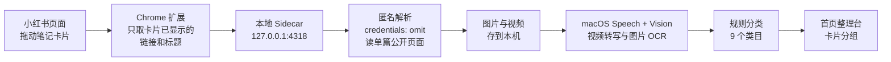

<div align="center">


# Kanbox

**专治收藏夹吃灰 —— 让存过的小红书笔记，这次真的找得回来。**


<br /><br />


<sub>收藏进来的笔记按类目摊在整理台上，每个分组是一叠可以展开的卡片</sub>

</div>

---

拖一条笔记进来，本地解析正文、下载配图、跑 OCR 把图里的文字也读出来，然后自动归类到首页。

**不依赖任何爬虫工具，也不用你的账号登录态去发请求。** 解析走的是匿名访问单篇公开页面，一次一条、由你手动触发 —— 不带 Cookie、没有批量抓取、没有定时任务，所以封控风险很低，不用担心账号出问题。

数据全程存在你自己的电脑上，不上传云端，不需要 AI API key。

## 🆕 v0.3.3 更新

- **服务连接修复** — 修复「本地服务未连接」问题，改善模块路径解析和 Node 发现
- **窗口拖动修复** — 修复窗口不可拖动问题，优化 CSS drag 区域
- **Agent 检测修复** — 增强 Claude Code/Codex 路径检测，支持更多安装位置
- **GitHub 按钮修复** — 修复扩展下载按钮点击无反应问题
- **导出功能修复** — 修复导出失败问题，添加服务健康检查
- **设置面板优化** — 加快动画速度，异步加载数据

## 🆕 v0.3.2 更新

- **窗口定位修复** — 修复窗口卡在右下角的问题，启动时自动居中
- **本地服务启动修复** — 新电脑安装后自动修复 Node 二进制权限，解决「本地服务未连接」
- **扩展引导优化** — 插件安装引导改为从 GitHub 下载，附详细步骤
- **导出功能修复** — 修复导出按钮「load failed」错误，改用 blob 下载

## 🆕 v0.3.1 更新

- **批量导出** — 支持 Markdown 和 HTML 格式批量导出所有笔记
- **拼音搜索** — 输入拼音首字母即可搜索中文笔记（如 'shouji' 匹配 '手机'）
- **模糊匹配** — 字符按顺序出现即可匹配
- **用户引导** — 首次使用时显示 3 步引导流程
- **多语言支持** — 中文/英文界面，设置页面切换语言

## 🆕 v0.2.1 更新

- **快手支持** — 浏览器扩展可收藏快手视频和图片
- **头条支持** — 浏览器扩展可收藏头条文章和视频
- **备份恢复** — 设置页面支持从 JSON 备份文件恢复数据
- **扩展 Popup 增强** — 显示当前平台指示器（支持 7 个平台）
- **数据迁移** — 支持从旧版本备份文件导入笔记

## 🆕 v0.2.0 更新

- **自动定时备份** — 每日自动备份，保留最近 7 份，存储在 data/backups/
- **实时更新** — 使用 Server-Sent Events 替代 2 秒轮询，笔记变更即时刷新
- **虚拟列表优化** — 100+ 笔记时只渲染可见区域，大幅降低内存占用
- **AI 摘要** — 本地文本提取摘要（无需 API key），点击笔记详情中生成
- **抖音支持** — 浏览器扩展可收藏抖音视频和笔记
- **知乎支持** — 浏览器扩展可收藏知乎文章和回答
- **Bug 修复** — 修复新电脑本地服务启动失败、CI 测试失败等问题

## 🆕 v0.1.0 更新

- **设置页面** — 数据统计、备份创建、数据完整性检查与修复
- **标签管理** — 查看所有标签、批量重命名、批量删除
- **分组拖拽排序** — 自定义分组支持拖拽调整顺序
- **B站支持** — 浏览器扩展可收藏 Bilibili 视频和文章
- **微博支持** — 浏览器扩展可收藏微博帖子和图片
- **Firefox 兼容** — 浏览器扩展支持 Firefox 109+

## 🆕 v0.0.3 更新

- **扩展 Popup 面板** — 点击扩展图标查看连接状态、收藏统计、最近收藏
- **右键菜单收藏** — 右键笔记链接或图片，一键收藏到 Kanbox
- **已收藏标记** — 小红书页面上已收藏的笔记显示绿色 ✓ 标记
- **扩展图标** — 全新设计的扩展图标（16/32/48/128px）
- **安装引导优化** — 应用内插件安装引导更清晰

## 🆕 v0.0.2 更新

- **窗口拖动修复** — macOS 下可正常拖动窗口
- **分组删除** — 自定义分组支持删除
- **键盘快捷键** — ⌘+F 搜索、⌘+N 新建分组、⌘+E 导出、Escape 关闭
- **图片全屏查看** — 点击图片进入全屏 lightbox
- **查看原帖** — 笔记详情中可打开小红书原帖
- **笔记排序** — 最新/最早/标题三种排序
- **批量选择** — 多选笔记进行批量操作
- **暗色模式** — 自动跟随系统设置
- **新笔记标记** — 24 小时内的笔记显示绿色圆点

## 🆕 v0.0.1 更新

- **粘贴链接导入** — 无需打开小红书页面，直接粘贴笔记 URL 即可导入
- **笔记编辑** — 支持修改标题和标签，修正 OCR 识别错误
- **数据导出** — 一键导出全部笔记为 JSON 备份文件
- **分类筛选** — 搜索栏新增类目筛选 chips，快速定位笔记
- **项目重命名** — 从「看看收藏」正式更名为 Kanbox

## 🤔 为什么做这个

小红书用户自己最常说的一句话就是**收藏夹吃灰** —— 收藏的那一下确实觉得有用，然后就再也没打开过。

但吃灰不全是懒，是收藏夹本身没法用：

- 存了三百条，想找那条讲配色的，翻不到 —— 收藏夹不支持搜正文
- 干货全写在图片里，搜索框对图里的字完全无能
- 笔记被作者删了、被限流了，你的收藏就变成一张灰色占位图
- 想分类得手动建收藏夹，建完也懒得整理

于是「等有空再看」就变成了永远不看。

这个 App 的思路很简单：**把你在意的那几条，抄一份到自己电脑上。** 正文、配图、视频、图里的文字和视频文稿都存在本机。之后搜关键词就能命中，原帖删了也不影响你 —— 灰就吃不起来了。

## ✨ 能做什么

| | 功能 | 说明 |
|:--:|---|---|
| 🖱️ | **拖拽导入** | 从小红书搜索页直接把笔记卡片拖进 App 画布，或在笔记详情页拖右下角按钮 |
| 📋 | **粘贴链接导入** | 直接粘贴小红书笔记 URL，无需打开小红书页面 |
| 🖱️ | **右键收藏** | 右键笔记链接或图片，一键收藏到 Kanbox |
| ✓ | **已收藏标记** | 小红书页面上已收藏的笔记显示绿色标记 |
| 📺 | **多平台支持** | 支持小红书、B站、微博、抖音、知乎、快手、头条内容收藏 |
| 🔍 | **图片文字可搜** | 调用 macOS 原生 Vision 框架做本地 OCR，中英文都认，图里的干货变成可搜索文本 |
| 🔤 | **拼音搜索** | 输入拼音首字母搜索中文笔记，支持模糊匹配 |
| 🤖 | **AI 摘要** | 本地文本提取摘要，无需 API key，一键生成笔记要点 |
| 🎬 | **视频文稿** | 视频保存到本机，使用 macOS 离线 Speech 分段转写完整语音 |
| 🗂️ | **自动分类** | 按标题、正文、OCR 文本和标签打分，自动分到 9 个类目 |
| 🖼️ | **配图本地化** | 图片下载到本机，原帖删除、限流、防盗链都不影响你已存的内容 |
| 🤖 | **Agent 可读** | 内置 MCP server，Claude Code / Codex 可以直接搜你的本地笔记库当资料 |
| 📝 | **笔记编辑** | 修改标题、标签，修正 OCR 错误 |
| 💾 | **数据导出** | 一键导出全部笔记为 JSON 备份文件 |
| 🏷️ | **分类筛选** | 按类目快速筛选，结合关键词搜索 |
| ⚙️ | **设置页面** | 数据统计、备份管理、数据完整性检查 |
| 🏷️ | **标签管理** | 查看、重命名、删除标签，批量操作 |
| 📊 | **分组排序** | 自定义分组支持拖拽调整顺序 |
| 🛡️ | **封控风险低** | 不是爬虫，不用你的登录态发请求。不读 Cookie、不登录、不批量、不做后台抓取 |

## 🔄 工作原理



关键点：第 4 步的解析请求**显式带 `credentials: 'omit'`**，不携带任何 Cookie。失败就直接报错，**不会回退到你登录着的浏览器**。整条链路只处理你手动拖进来的那一条笔记。

## 🛡️ 为什么不用担心封号

市面上大多数小红书工具是**爬虫思路**：拿你的 Cookie 或扫码登录，然后用你的身份去批量请求接口。这种做法效率高，但风控一来账号就没了 —— 461、471、滑块验证、限流、封禁都是常见结局。

这个项目走的是另一条路：

| | 爬虫工具 | Kanbox |
|---|---|---|
| 身份 | 用你的账号登录态发请求 | **匿名请求，不带 Cookie** |
| 频率 | 批量、定时、自动翻页 | **一次一条，你手动拖才触发** |
| 入口 | 逆向接口 | 你已经打开的那个公开页面 |
| 失败时 | 换 UA、换代理、重试 | **直接报错，不绕验证** |
| User-Agent | 伪装成真实浏览器 | **老实自报身份，不伪装** |
| 封控风险 | 高 | **很低** |

代码层面都可以核对：

- 解析请求显式写着 `credentials: 'omit'` —— `scripts/lib/anonymous-note-resolver.mjs:186`
- 图片和视频下载同样不带凭证 —— `scripts/lib/media-import.mjs`、`scripts/lib/video-import.mjs`
- UA 是 `KanboxFavorites/0.1 anonymous-local-resolver`，**没有伪装成 Chrome**，平台一看就知道这是谁在请求
- 没有代理池、没有重试退避、没有 UA 轮换 —— 这些爬虫标配一个都没有

**匿名解析失败时直接抛错，不会回退到你登录着的浏览器** —— 宁可这一条导不进来，也不动你的账号。

> 严格说没有任何第三方工具能承诺 100% 安全。但这里的请求模式和你自己用浏览器点开一篇笔记基本没区别，也不涉及任何账号行为，所以风险很低。

## 🔐 隐私边界（这部分请认真看）

这个项目对「能碰什么」划得很死，因为它处理的是你的浏览记录：

**✅ 会做的**

- 只解析你手动拖进来的**单条**公开笔记页面
- 匿名 HTTP 请求，不带 Cookie、不带 token
- 图片只从 `.xhscdn.com` / `.xhsimg.com` 下载，其他域名直接拒绝
- 所有数据写在本机目录，服务只监听 `127.0.0.1`
- OCR 用 macOS 系统框架跑，图片不出本机

**❌ 不会做的**

- 不读你的小红书 Cookie 或登录态
- 不访问收藏夹、关注列表、评论接口
- 不做定时任务、后台抓取、批量同步
- 不调用任何远程 AI 服务，**不需要 API key**
- 不上传任何数据到任何服务器

**Chrome 扩展的权限清单**（`browser-extension/manifest.json`，可以自己核对）：

```json
"host_permissions": ["http://127.0.0.1:4318/*"]
```

只有本地回环地址一条。**没有 `tabs`、没有 `cookies`、没有 `webRequest`** —— 扩展在技术上就不具备后台开标签页或读取账号凭证的能力，它唯一做的事是把你正在看的这个卡片上已经显示出来的链接和标题，递给本地服务。

## 📦 安装

> ⚠️ 目前是 **macOS 13+、Apple Silicon 专用**。本地 OCR 和视频文稿依赖系统的 Vision / Speech 框架。

### 推荐：下载 Release 安装包

从 [GitHub Releases](https://github.com/sexyfeifan/Kanbox/releases/latest) 下载最新 DMG，把「Kanbox」拖进”应用程序”即可；安装包已包含运行环境，**不需要 Node.js、npm 或终端命令**。

因为当前版本没有 Apple Developer 公证，首次打开如果被 macOS 拦截：先尝试打开一次，再前往 **系统设置 → 隐私与安全性 → 仍要打开**。只需操作一次。

### 从源码构建

```bash
git clone https://github.com/sexyfeifan/Kanbox.git
cd Kanbox
npm install
npm run tauri:build
```

产物在 `src-tauri/target/release/bundle/`，装完打开「Kanbox」。

### 装 Chrome 扩展

App 里点「浏览器插件」按钮会自动帮你打开 Chrome 扩展页和插件文件夹。或者手动：

1. Chrome 打开 `chrome://extensions`
2. 右上角开启 **开发者模式**
3. 点 **加载已解压的扩展程序**，选本项目的 `browser-extension/` 目录

> Tauri 不能替你安装 Chrome 扩展，这一步只能手动。

### 开始用

**方式一：拖拽导入**

打开小红书搜索页，**把笔记卡片拖进 App 窗口的任意位置**。画布会依次显示识别 → 匿名解析 → 保存图片和 OCR → 收录完成。

也可以打开笔记详情页，拖右下角那个按钮。

**方式二：粘贴链接**

点击底部的「粘贴链接」按钮，输入小红书笔记 URL，回车即可导入。无需打开小红书页面。

## 🤖 接入 Claude Code / Codex

这是我自己最常用的功能：**让 AI 直接查我的收藏当资料**。

App 里点「连接 Agent」，选 Claude Code 或 Codex，它会自动注册一个叫 `kanbox-notes` 的 MCP server。之后重开一个会话就能用了。

手动配置的话：

```bash
# Claude Code
claude mcp add --scope user kanbox-notes \
  -e "LOCAL_APP_DATA_DIR=$HOME/Library/Application Support/com.kanbox.app" \
  -- node /path/to/scripts/kanbox-mcp.mjs

# Codex
codex mcp add kanbox-notes \
  --env "LOCAL_APP_DATA_DIR=$HOME/Library/Application Support/com.kanbox.app" \
  -- node /path/to/scripts/kanbox-mcp.mjs
```

提供两个**只读**工具：

| 工具 | 作用 |
|---|---|
| `search_saved_notes` | 搜本地笔记，覆盖标题、正文、图片 OCR、标签、作者、分类 |
| `read_saved_note` | 按 ID 读一条笔记的完整正文和逐图 OCR 文本 |

两个工具都只读本机 `notes.json`，不联网、不碰小红书账号。

于是可以这么用：

> 「从我收藏的笔记里找几条讲液态动效的，总结一下实现思路」
>
> 「我之前收藏过一个 ASCII 风格设计的案例，把原文找出来」

## 🗂️ 自动分类

按标题、正文、OCR 文本、标签加权打分，命中最高的类目胜出，分数不够则留在「待分类」：

`编程开发` · `AI工具` · `阅读思考` · `设计美学` · `旅行户外` · `美食餐饮` · `影像创作` · `方法论` · `生活方式`

规则是纯正则表格，写在 `scripts/lib/category-inference.mjs`，**按自己的兴趣改这个文件就行**，不需要训练也不需要模型。

分组可以展开成平铺的卡片墙，每张卡上带着自动打的类目标签。分组名也能自己改 —— 比如把一堆买了没看的书归到「假装阅读」：

<div align="center">
  
</div>

## 💾 数据存在哪

```
~/Library/Application Support/com.kanbox.app/
├── notes.json          # 所有笔记的正文、文稿、OCR、元数据
├── media/<noteId>/     # 每条笔记的配图与视频
└── settings.json
```

- **备份**：直接拷走这个文件夹，或在 App 中点击「导出」按钮下载 JSON 备份
- **彻底删除**：删掉这个文件夹，App 就回到空白状态
- **仓库里不含任何笔记数据**，`.gitignore` 也挡住了，不用担心 commit 的时候把收藏推上去

## 🛠️ 本地开发

```bash
npm install

# 起前端 + 本地服务（两个终端）
npm run dev
npm run local-api

# 或者直接跑桌面版
npm run tauri:dev
```

验证：

```bash
npm test
npm run lint
npm run build
```

## 🔌 本地接口

服务监听 `http://127.0.0.1:4318`，只接受来自 localhost、Tauri 和本扩展的请求。

| Method | Path | 作用 |
|---|---|---|
| `GET` | `/health` | 健康检查，返回数据目录和 OCR 可用性 |
| `GET` | `/notes` | 全部笔记 |
| `POST` | `/notes/import` | 导入一条笔记 |
| `PATCH` | `/notes/:id` | 更新笔记标题和标签 |
| `DELETE` | `/notes/:id` | 删除笔记，连带删除本地媒体 |
| `GET` | `/notes/export` | 导出全部笔记为 JSON 备份文件 |
| `GET` | `/media/:noteId/:file` | 读取本地图片或视频 |
| `GET` | `/data/info` | 数据目录统计信息 |
| `GET` | `/setup` | 扩展与 Agent 的安装状态 |
| `POST` | `/setup/browser-extension/open` | 打开扩展配置页 |
| `POST` | `/setup/agent/connect` | 注册 MCP server |

端口可以用 `LOCAL_API_PORT` 改，数据目录可以用 `LOCAL_APP_DATA_DIR` 改。

## 🧱 技术栈

- **前端** Next.js 16 · React 19 · Tailwind CSS 4 · Framer Motion
- **桌面** Tauri 2
- **本地服务** Node.js sidecar（零依赖，只用标准库）
- **OCR** macOS Vision 框架，经 JXA 调用，识别 `zh-Hans` / `zh-Hant` / `en-US`
- **视频文稿** macOS Speech 强制设备端识别；不支持离线识别时不会回退到云端

## ⚠️ 已知限制

- **仅 macOS**：OCR 和视频文稿依赖 Vision / Speech 框架
- **离线转写兼容性**：只有系统报告支持中文设备端识别时才会生成视频文稿
- **小红书改版会失效**：扩展的 DOM 选择器和页面状态解析规则依赖当前页面结构，改版后需要跟着更新
- **匿名解析可能失败**：页面拒绝匿名访问时导入会报错。这是设计如此 —— 不会为了成功率去用你的登录态
- **不支持批量导入**：一次一条，没有收藏夹同步。这也是故意的
- **未公证版本**：首次打开需要在「系统设置 → 隐私与安全性 → 仍要打开」中手动允许

## 📄 License

[AGPL-3.0-or-later](LICENSE)

可以商用，也可以随便改。但如果你**修改后对外分发，或者拿它提供网络服务**，必须以同样的 AGPL 协议公开你的改动源码。

换句话说：欢迎拿去用、拿去改、拿去卖，但不能闭源套壳。
